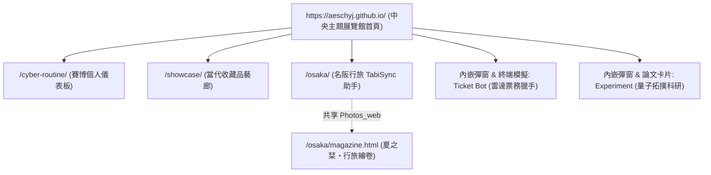
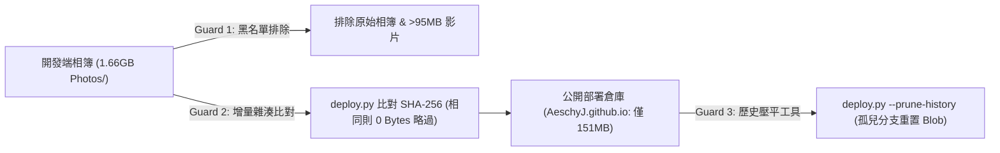

# 🏛️ GitHub Pages 多專案統一架構與沉浸式主題展館標準規範書
**Architecture Specification & Operations Manual for `AeschyJ.github.io`**

> **版本**：v2.0.0 (Production Release)  
> **最後更新時間**：2026 年 9 月  
> **託管站點**：[https://aeschyj.github.io/](https://aeschyj.github.io/)  
> **公開倉庫**：`https://github.com/AeschyJ/AeschyJ.github.io`

---

## 📖 目錄 (Table of Contents)
- [一、 系統概述與設計哲學](#-一-系統概述與設計哲學)
- [二、 系統拓撲與路徑對照表](#-二-系統拓撲與路徑對照表)
- [三、 沉浸式五大主題展館規範](#-三-沉浸式五大主題展館規範)
- [四、 同源安全與隔離防護協議 (Shared Origin Defense)](#-四-同源安全與隔離防護協議-shared-origin-defense)
- [五、 多媒體與 Git 容量防膨脹機制](#-五-多媒體與-git-容量防膨脹機制)
- [六、 智慧發布管線與防呆工具 (deploy.py / deploy.bat)](#-六-智慧發布管線與防呆工具-deploypy--deploybat)
- [七、 標準維護作業流程 (Standard Operating Procedures - SOP)](#-七-標準維護作業流程-standard-operating-procedures---sop)
- [八、 疑難排解指南 (Troubleshooting FAQ)](#-八-疑難排解指南-troubleshooting-faq)

---

## 🌟 一、 系統概述與設計哲學

本專案旨在將分散於各獨立私有儲存庫的 Web 應用程式、演算法模型、後端自動化機器人及文化旅誌，統一收納至單一 GitHub Pages 頂級網域名稱（`https://aeschyj.github.io`）下。

### 核心設計哲學：
1. **100% 原始碼隱私安全（Source Privacy Isolation）**：
   開發過程、Git Commit 歷史、私人筆記與機密環境變數完全保留於**私有倉庫**。公開倉庫僅存放編譯混淆後的純靜態產物（dist），物理隔離外洩風險。
2. **零伺服器零成本集中託管（Zero-Cost Static Hosting）**：
   完全捨棄 Vercel、Netlify 等第三方平台之商用限制與頻寬收費隱患，善用 GitHub Pages 提供的高可用性靜態 CDN。
3. **沉浸式動態多主題展館（Ambient Pavilion System）**：
   拒絕千篇一律的卡片排版。全站以深太空黑（`#08090d`）為基底，結合 `IntersectionObserver` 視窗監聽，隨訪客滾動依序過渡專屬主題色溫（量子紫 ➔ 鳥居櫻紅 ➔ 建築冰藍 ➔ 航管雷達橘 ➔ 賽博螢光綠），賦予每個專案獨一無二的美學與互動靈魂。
4. **同源環境下的嚴格安全防禦（Shared Origin Sandbox）**：
   針對 GitHub Pages 子目錄共用 Origin 之限制，建立嚴格的 Service Worker 快取前綴隔離與 LocalStorage 命名空間規範，杜絕應用間快取互踩與狀態污染。

---

## 🗺️ 二、 系統拓撲與路徑對照表

全站所有模組均部署於單一 Origin 下，各專案維持獨立子路徑與隔離快取空間：



| 模組名稱 | 展館識別代號 | 線上訪問路徑 | 原始碼來源 (Private Repo) | 公開部署位置 (`AeschyJ.github.io`) | 專案技術棧 |
| :--- | :---: | :--- | :--- | :--- | :--- |
| **中央門戶首頁** | `hub` | `https://aeschyj.github.io/` | `AeschyJ.github.io` (Root) | `/` (根目錄 `index.html` + assets) | 原生 HTML5 + ES Module + Web Audio + PWA |
| **量子實驗室** | `exp` | 展館內嵌互動 + 論文 PDF | `Experiment` | `/` (主頁動態組件渲染) | PyTorch / Python (前端互動模擬) |
| **名阪行旅手帖** | `osk` | `https://aeschyj.github.io/osaka/` | `OSAKA` (`clever-turing`) | `/osaka/` (靜態專案目錄) | 原生 JS + Leaflet + PWA + 離線手帖 |
| **夏之栞・繪卷** | `osk` | `https://aeschyj.github.io/osaka/magazine.html`| `OSAKA` (`clever-turing`) | `/osaka/magazine.html` | 越前和紙雜誌閱覽器 (共享 `Photos_web/`) |
| **當代收藏藝廊** | `show` | `https://aeschyj.github.io/showcase/` | `AntigravityHub/showcase` | `/showcase/` (存放 Vite build 產物) | React 19 + TypeScript + Vite 8 + PWA |
| **雷達票務獵手** | `tic` | 展館微型終端模擬 + 架構彈窗 | `Ticket Bot` | `/` (主頁動態組件渲染) | Python 3 + Webhook (前端日誌串流模擬) |
| **賽博日常儀表板**| `cyb` | `https://aeschyj.github.io/cyber-routine/` | `AntigravityHub/cyber-routine` | `/cyber-routine/` (存放 Vite build 產物) | React 19 + TypeScript + Vite 8 + PWA |

---

## 🎨 三、 沉浸式五大主題展館規範

展覽館展示順序嚴格遵循由學術深度、文化旅情，經當代美學、後端高頻架構，至高能量自律控制台之動線排布：

```
[Hero 星雲] ➔ 1. [exp 量子紫] ➔ 2. [osk 鳥居紅] ➔ 3. [show 建築藍] ➔ 4. [tic 航管橘] ➔ 5. [cyb 賽博綠]
```

### 展館視覺與微互動規格表

| 序號 | 展館 ID | 名稱與核心理念 | 代表色票 (Design Tokens) | 特色裝飾與視覺語彙 | 專屬簽名微互動 (Signature Micro-Interaction) |
| :---: | :---: | :--- | :--- | :--- | :--- |
| **-** | **Hero** | **門戶星雲大廳**<br/>高冷暗黑科技感 | 背景 `#08090d`<br/>文字 `#f0f2f5`<br/>天青藍 `#38bdf8` | 流體動態光球、頂部懸浮毛玻璃導航欄、最近造訪快速直達標籤、釘選抽屜 | Web Audio 微頻音效、滾動指引呼吸動態、全站 PWA 安裝 |
| **1** | **`exp`** | **Experiment**<br/>學術未來主義 | 量子紫 `#a855f7`<br/>冰霜銀白 `#e2e8f0` | 幾何拓撲網格、HUD 科技角標、LaTeX 公式浮水印、SOTA/arXiv 徽章 | **互動 Benchmark 長條圖**（切換 Baseline vs Ours 數值平滑遞增）、論文研究架構拓撲彈窗 |
| **2** | **`osk`** | **Osaka Trip**<br/>日系和風行旅雜誌 | 鳥居朱紅 `#e11d48`<br/>櫻花粉 `#f43f5e`<br/>深炭墨黑 `#18181b` | 越前和紙底紋、直書排版（`writing-mode: vertical-rl`）、金箔漂浮粒子 | **御朱印互動蓋章**（點擊觸發水墨落款動畫 + 木擊沉著音效 + LocalStorage 狀態儲存）、**雙入口啟動按鈕**、迷你繪卷折本預覽 |
| **3** | **`show`**| **Showcase**<br/>包浩斯當代藝廊 | 建築冰藍 `#60a5fa`<br/>石板霧黑 `#0f172a` | 雙層藍圖工程網格（Blueprint Grid）、極光流星流光邊框（`@property` 驅動） | **3D 視差陀螺儀卡片**（滑鼠座標插值傾斜 + 鏡面反光 Sheen）、一鍵進入應用 |
| **4** | **`tic`** | **Ticket Bot**<br/>暗夜航管雷達系統 | 琥珀金橘 `#f59e0b`<br/>航管黑 `#0a0b0e` | CRT 掃描線、閃爍 LED 狀態燈（`[STANDBY]` ➔ `[ACTIVE]`）、雷達掃描盤 | **微型終端日誌瀑布**（點擊觸發模擬搶票毫秒日誌噴發 + Webhook 模擬推播彈窗）、系統架構白皮書彈窗 |
| **5** | **`cyb`** | **Cyber-Routine**<br/>賽博龐克極客風 | 終端黑 `#0a0e14`<br/>霓虹螢光綠 `#00ff9d`<br/>警示金 `#ffb700` | 像素點陣紋理、CRT 打字機終端、習慣矩陣 HUD 角標 | **連擊充能 (Combo +1)**（數值跳動記憶 + Canvas 2D 金色星芒粒子爆破 + 原生 8-bit 雙方波琶音金幣音效） |

### 插件化展館外掛架構 (Plugin Architecture)
主頁核心引擎（`js/app.js`）與展館外掛完全解耦，每個展館實作標準生命週期合約：
```javascript
export const myPavilion = {
  mount(slotElement, meta) {
    // 渲染專屬卡片 DOM、綁定專屬互動事件
  },
  unmount() {
    // 銷毀定時器、事件監聽器，防範記憶體洩漏
  },
  onEnterViewport() {
    // 進入視窗：啟動動畫、粒子運算
  },
  onLeaveViewport() {
    // 離開視窗：凍結動畫迴圈，降低手機發燙與耗電
  }
};
```

---

## 🛡️ 四、 同源安全與隔離防護協議 (Shared Origin Defense)

在 GitHub Pages 託管環境下，`aeschyj.github.io` 的所有子路徑共用同一個瀏覽器 Origin。為杜絕相互踩踏，全站強制落實四大隔離協議：

### 1. Service Worker 快取防踩踏過濾（Cache Namespace Isolation）
🚨 **致命痛點**：標準 SW 在 `activate` 時習慣呼叫 `caches.delete(key)` 清除非當前版本的快取，這會誤殺同源下其他專案的離線快取。  
✅ **防禦規範**：所有專案的 `sw.js` 嚴格限制快取清理過濾器：
```javascript
// 各專案僅能清除帶有自身專屬前綴的舊快取！
caches.keys().then((keys) =>
  Promise.all(
    keys
      .filter((k) => k.startsWith('<PROJECT_PREFIX>-') && k !== CURRENT_CACHE_NAME)
      .map((k) => caches.delete(k))
  )
);
```
* **門戶首頁**：前綴 `hub-portal-cache-`
* **賽博日常**：前綴 `cyber-routine-cache-`
* **當代藝廊**：前綴 `museum-showcase-`
* **名阪行旅**：前綴 `tabisync-` 與 `shiori-`

### 2. LocalStorage 鍵值命名空間協議（Storage Key Namespaces）
所有寫入瀏覽器 `localStorage` 的資料必須攜帶專屬前綴，禁止宣告全域無前綴通用鍵：
* **中央展覽館**：`hub_recent_visited`, `hub_pinned_pavilions`, `hub_preferences`, `hub_audio_enabled`, `hub_fx_enabled`, `hub_cyber_combo_streak`, `hub_osaka_goshuin_stamped`
* **賽博日常**：`cyber_routine_state`, `cyber_routine_google_access_token`, `cyber_routine_google_token_expires_at`
* **當代藝廊**：`showcase_theme`, `showcase_layout_mode`, `showcase_active_tab`, `showcase_sort_by`, `museum_cached_data`
* **名阪行旅**：`TABISYNC_CHECKED_NODES`, `TABISYNC_JOURNAL_DATA`, `emaki_view_mode`, `shiori_emaki_stamps` 等

### 3. Vite 相對路徑強制規範（Vite Base Guard）
Vite 預設 `base: '/'` 會將靜態資源指向網域根目錄，導致部署於子路徑（如 `/showcase/`）時資源請求全數 404 白畫面。  
✅ **規範**：所有 Vite 子專案之 `vite.config.ts` 必須顯式聲明：
```typescript
export default defineConfig({
  base: './', // 強制相對路徑尋址
  // ...
});
```

### 4. 微縮回航膠囊協議（Floating Portal Pill）
為確保訪客跳轉至子應用後具備一致的回航體驗，所有子應用均引入 [`portal-pill.js`](file:///d:/Liao/Documents/Antigravity/Github%20Page/cyber-routine/portal-pill.js)：
* **Shadow DOM 封裝**：與宿主專案 CSS 100% 隔離，零樣式污染。
* **自動微縮（Idle Mode）**：無操作 3.5 秒自動收斂為 40px 半透明極致小圓點；游標懸停或滾動時瞬時展開。
* **PWA 與 Safe Area 適配**：支援 `display-mode: standalone` 並自適應手機底部安全區域。

---

## 📦 五、 多媒體與 Git 容量防膨脹機制

### 1. 為什麼 Git 託管大圖會膨脹？
Git 無法對已壓縮之二進位圖檔（JPEG/WebP）進行差異增量壓縮（Delta Compression）。哪怕只微調單張相片，Git 也會將整張圖片視為全新 Blob 永久寫入 `.git/objects` 歷史中。頻繁更新圖片會導致倉庫體積暴增至數 GB，觸發 GitHub 100MB 單檔阻擋或 1GB 推薦上限。

### 2. 三道立體防護線：

1. **第一道防線：黑名單攔截**：
   嚴格排除 `Nagoya&Osaka Trip` 內 1.66GB 的相機原始庫 `Photos/` 與單檔超過 100MB 的影片，僅同步 Web 壓縮優化相簿 `Photos_web/`（134MB）。
2. **第二道防線：智慧增量雜湊比對（Smart Hash Sync）**：
   `deploy.py` 在複製圖檔前計算 SHA-256 雜湊與檔案大小。未修改之圖檔直接略過且不更動修改時間（mtime），傳輸流量為 0 Bytes，絕不產生假性 Commit。
3. **第三道防線：Git 歷史壓平機制（Squash / Orphan Branch）**：
   公開倉庫實質僅為靜態託管 CDN，無須保留歷史 commit。當 `.git` 累積過大時，執行 `deploy.py --prune-history` 可一鍵建立孤兒分支並執行 `git gc --prune=now --aggressive`，秒級將 `.git` 重置洗白。

---

## 🚀 六、 智慧發布管線與防呆工具 (deploy.py / deploy.bat)

我們在 `Github Page/scripts/` 開發了純 Python 3 標準庫實現的高可靠跨專案發布引擎，並在根目錄提供方便雙擊執行的 `deploy.bat`。

### 1. 核心 5 重安全防呆機制 (5-Layer Safety Guard)
* **Guard 1 (Large File Sentinel)**：檢測檔案大小，若單檔 >95MB 立刻拋出例外中斷發布，防止 GitHub 100MB 限制導致 Push 失敗。
* **Guard 2 (Blacklist Guard)**：絕對排除 `Photos/`、`.git`、`node_modules`、`__pycache__`、`scratch`、`.env*` 等機密與大型檔案。
* **Guard 3 (Vite Base Guard)**：建置前解析 `vite.config.ts`，確認包含 `base: './'`，否則終止建置。
* **Guard 4 (PWA Scope Guard)**：檢驗 SW 預快取陣列，嚴格攔截 `'/'` 等絕對路徑。
* **Guard 5 (Smart Hash Sync)**：增量比對 SHA-256 雜湊，防止歷史重複寫入。

### 2. 命令列 CLI 語法規範
```bash
# 全量編譯並發布所有專案 (cyber, showcase, osaka)
python scripts/deploy.py --all

# 僅發布單一專案
python scripts/deploy.py --cyber       # 僅發布賽博日常
python scripts/deploy.py --showcase    # 僅發布當代收藏藝廊
python scripts/deploy.py --osaka       # 僅發布名阪行旅雙站點

# 模擬乾跑檢查 (不寫入磁碟)
python scripts/deploy.py --all --dry-run

# 壓平 Git 歷史 (清理歷史累積的大圖 Blob)
python scripts/deploy.py --prune-history

# 啟動互動式終端選單
python scripts/deploy.py --menu
```

### 3. Windows 批次選單操作 (`deploy.bat`)
雙擊根目錄下的 `deploy.bat`，即可呼叫終端互動選單：
```
================================================================================
   🚀 GITHUB PAGES 智慧發布與 5 重防呆管線 (Deploy Pipeline Architect)
================================================================================
  [1] 🚀 全量發布 (All Projects: cyber-routine + showcase + osaka)
  [2] ⚡ 僅發布 賽博日常 (cyber-routine)
  [3] 🎨 僅發布 當代收藏品藝廊 (showcase)
  [4] 🏯 僅發布 大阪旅行攻略 (osaka)
  [5] 🔍 模擬乾跑檢查 (Dry-run All: 僅防呆驗證與比對，不寫入檔案)
  [6] 🧹 壓平公開倉庫 Git 歷史 (Prune History: 清理過往歷史大圖 Blob)
  [0] 🚪 離開 (Exit)
--------------------------------------------------------------------------------
請輸入操作編號 [0-6]:
```
> 💡 **自動推送整合**：在按下 `1` 或 `6` 完成處理後，腳本會自動偵測變更並主動詢問：  
> `是否立即 Commit 並推送 (git push origin main) 至 GitHub？ [Y/n]:`  
> 按下 **Enter** 即可全自動完成遠端部署！

---

## 📋 七、 標準維護作業流程 (Standard Operating Procedures - SOP)

### SOP 1：日常子專案修改與發布
當您在私有倉庫（如修改了 `AntigravityHub/showcase` 或 `cyber-routine`）完成功能開發後：
1. **本地測試**：在私有專案內部確認測試正常。
2. **啟動發布**：切換至 `d:\Liao\Documents\Antigravity\Github Page` 目錄，雙擊 `deploy.bat`。
3. **選擇目標**：
   - 輸入 `3`（僅發布 showcase）或 `1`（全量發布）。
4. **確認推送**：腳本自動完成建置與增量同步後，於終端提示 `是否立即 Commit 並推送 至 GitHub？` 時按下 **Enter**。
5. **線上驗證**：約 1~2 分鐘後訪問 `https://aeschyj.github.io/` 確認生效。

---

### SOP 2：新增一個全新的 Web App 至展館
當您未來開發出全新的前端應用（例如 `pixel-game`）想加入展覽館時：
1. **子專案檢查**：
   - 若為 Vite 專案，確保 `vite.config.ts` 設定 `base: './'`。
   - 若使用 Service Worker，確保清理邏輯帶有專屬前綴 `pixel-game-`。
   - 引入微縮回航膠囊：`<script src="./portal-pill.js"></script>`。
2. **擴充發布引擎配置**：
   - 打開 `Github Page/scripts/deploy.py`，在 `PROJECT_CONFIGS` 字典中新增項目：
     ```python
     "pixel": {
         "name": "像素遊戲機 (pixel-game)",
         "type": "vite", # 或 "static"
         "src_dir": WORKSPACE_ROOT / "AntigravityHub" / "pixel-game",
         "dest_dir": BASE_DIR / "pixel-game",
     }
     ```
3. **定義展館元數據**：
   - 打開 `Github Page/js/data/pavilionsData.js`，在陣列中加入新展館設定（包含 ID、主題色票、圖示與跳轉路徑 `./pixel-game/`）。
4. **實作專屬主題樣式與微互動**：
   - 在 `Github Page/css/pavilions/` 新增 `pixel.css`（根選擇器 `.pavilion-pixel`）。
   - 在 `Github Page/js/pavilions/` 新增 `pixelPavilion.js`，實作 `mount/unmount` 並註冊至 `pavilionRegistry`。
   - 在 `index.html` 引入新 CSS，並在 `js/app.js` 引入新 JS。
5. **一鍵發布**：執行 `deploy.bat` 完成部署。

---

### SOP 3：新增非網頁型專案（後端服務 / CLI 工具 / AI 研究）
非前端展示型專案無需打包 HTML/dist，採「**展館沙盒模擬器**」模式：
1. 在 `pavilionsData.js` 中新增專案元數據，設定 `actionType: 'modal'`（不跳轉外部網頁，點擊彈出架構白皮書）。
2. 撰寫專屬互動組件（參考 `ticketPavilion.js` 的微型日誌終端模擬，或 `experimentPavilion.js` 的指標卡片切換）。
3. 訪客在主頁即可獲得直觀的互動展示，完全零伺服器後端負擔！

---

### SOP 4：倉庫容量健康維護與歷史壓平
建議每 3~6 個月或在對 `Photos_web/` 進行大規模替換後執行一次：
1. 雙擊執行 `deploy.bat`，輸入編號 `6`。
2. 腳本會顯示壓平前容量、壓平後容量與節省空間。
3. 出現 `是否立即強制推送 (git push -f origin main) 至遠端 GitHub？` 時輸入 `y` 並按 Enter。
4. 公開倉庫的歷史舊圖 Blob 瞬間被徹底消除，`.git` 體積回復至出廠輕量水準。

---

## ❓ 八、 疑難排解指南 (Troubleshooting FAQ)

#### Q1: 在 `deploy.bat` 執行推送後，GitHub 線上網站沒有即時更新？
* **原因**：GitHub Pages 採用全球 CDN，收到推送後需經由 GitHub Actions 或後台 Pages 管道重新部署，通常需等待 **1 至 3 分鐘**。
* **排查方法**：造訪 `https://github.com/AeschyJ/AeschyJ.github.io/actions`，確認部署 Workflow 是否正在進行（黃燈）或已完成（綠勾）。

#### Q2: 跳轉進入子應用時出現白畫面或 404？
* **檢查項目 1**：確認該專案之 `vite.config.ts` 是否宣告 `base: './'`。
* **檢查項目 2**：確認瀏覽器網址末端是否自帶尾隨斜線（如 `.../showcase/` 而非 `.../showcase`）。若無斜線，某些瀏覽器解析相對路徑可能偏移，應依賴 GitHub Pages 的 301 自動補斜線機制。

#### Q3: 修改子專案樣式後，重新整理依然看到舊版介面？
* **原因**：Service Worker 離線快取（Cache Storage）在背景生效中。
* **排查方法**：
  1. 在子專案的 `sw.js` 中遞增快取版本號（如 `v1` ➔ `v2`）。
  2. 開啟 Chrome DevTools，按住重新整理按鈕選擇「強制重新載入（Hard Reload）」，或在 `Application ➔ Service Workers` 勾選 `Update on reload`。

#### Q4: 執行 `git push -f origin main` 出現權限錯誤（Permission Denied / Authentication Failed）？
* **排查方法**：在 Windows 搜尋「認證管理員 (Credential Manager)」➔ 選擇「Windows 認證」，找到 `git:https://github.com`，更新您的 GitHub Personal Access Token (PAT) 確保具備 `repo` 完整權限。

---

> 🏛️ **AeschyJ Hub** — 極致簡約、堅實隔離、永續維護的個人數位結晶展覽中心。
