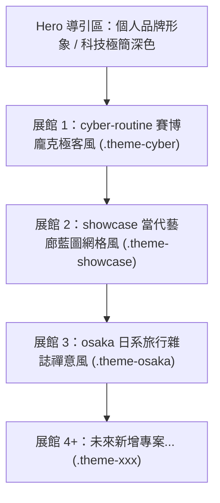
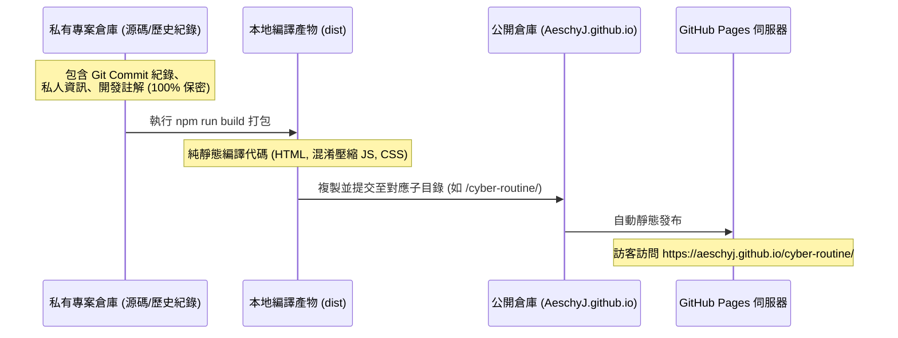

# 🏛️ GitHub Pages 多專案統一管理與主題展館設計表

本設計表旨在規劃將所有 Web App 統一收納至 GitHub Pages 個人網頁（`aeschyj.github.io`）之架構藍圖。兼顧**原始碼隱私安全**、**完全捨棄 Vercel 實現零成本集中託管**，以及**主頁分區展示各專案專屬風格**之設計規範。

---

## 🗺️ 一、 系統拓撲與網址路徑對照表

所有應用皆整合於單一頂級網域名稱下，各專案維持獨立子路徑與獨立快取空間：

| 模組名稱 | 線上訪問路徑 | 原始碼倉庫 (Private) | 部署位置 (公開倉庫：`AeschyJ.github.io`) | 專案技術棧 |
| :--- | :--- | :--- | :--- | :--- |
| **中央門戶首頁** | `https://aeschyj.github.io/` | `AeschyJ.github.io` (Root) | `/` (根目錄 `index.html` + assets) | 原生 HTML5 + 現代 CSS + JS |
| **賽博個人儀表板** | `https://aeschyj.github.io/cyber-routine/` | `AntigravityHub/cyber-routine` | `/cyber-routine/` (存放打包後的 dist) | React 19 + Vite + PWA |
| **當代收藏品藝廊** | `https://aeschyj.github.io/showcase/` | `AntigravityHub/showcase` | `/showcase/` (存放打包後的 dist) | React 19 + Vite + PWA |
| **大阪旅行攻略** | `https://aeschyj.github.io/osaka/` | `OSAKA` (`clever-turing`) | `/osaka/` (存放靜態網頁檔案) | 原生 JS + PWA + 離線地圖 |
| *(未來新增專案)* | `https://aeschyj.github.io/<app>/` | 各自獨立私人 Repo | `/<app>/` (打包後的 dist) | 任意前端技術棧 |

---

## 🎨 二、 主頁分區主題展館（Pavilion Specs）設計規範

主頁將規劃為**沉浸式多主題展覽廳**，每個分區透過 CSS 作用域（Theme Scope）隔絕樣式，完美呈現該專案專屬的美術語言：



### 分區美術風格細部規劃

| 分區識別 | 核心視覺理念 | 代表色票 (Design Tokens) | 特色裝飾與微互動 | 啟動按鈕跳轉 |
| :--- | :--- | :--- | :--- | :--- |
| **Hero 頂部** | 現代極簡、高冷暗黑科技感 | 背景 `#090a0f`、文字 `#f0f2f5`、強調天青藍 `#38bdf8` | 流體漸變光暈、全站導航列、快速檢索過濾器 | 快速滾動錨點 |
| **`.theme-cyber`**<br/>(賽博日常) | 賽博龐克 (Cyberpunk)、霓虹極客矩陣 | 螢光綠 `#00ff9d`、終端黑 `#0a0e14`、警示金 `#ffb700` | 像素網格紋理、掃描線微光、Confetti 動畫模擬 | 進入應用 `→ /cyber-routine/` |
| **`.theme-showcase`**<br/>(當代藝廊) | 包浩斯建築美學、極簡高級琉璃 | 建築冰藍 `#60a5fa`、石板霧黑 `#0f172a`、極光霓虹 | 雙層藍圖工程網格 (Blueprint Grid)、3D 浮空毛玻璃卡片、極光邊框光斑 | 進入應用 `→ /showcase/` |
| **`.theme-osaka`**<br/>(大阪攻略) | 日系旅行雜誌、現代和風與地圖質感 | 櫻花淺粉 `#f43f5e`、朱紅鳥居 `#e11d48`、溫潤米白/深炭灰 | 旅程動態時間軸卡片、精簡地圖路線示意、離線標章 | 進入應用 `→ /osaka/` |

---

## 🔒 三、 隱私與構建發布規範 (Build & Privacy Protocol)



### 關鍵安全與相容性檢查點：
1. **隱私保障**：絕對不將私人倉庫的 `.git` 夾同步到公開倉庫，公開倉庫僅有最終部署檔案。
2. **相對路徑配置**：
   * Vite 專案（如 `cyber-routine`、`showcase`）之 `vite.config.ts` 必須包含：
     ```typescript
     export default defineConfig({
       base: './', // 確保在任何子目錄均能正確載入資源
       // ...
     })
     ```
3. **PWA 快取隔離**：各 App 的 Service Worker（`sw.js`）註冊路徑維持相對路徑，快取名稱自帶前綴（如 `cyber-cache-v1`、`osaka-cache-v1`），避免互相污染。

---

## 🔄 四、 未來新增專案之標準維護 SOP

每當完成一個新的 Web App 時，只需執行標準 3 步驟：

```markdown
1. 【子專案打包】
   在子專案目錄執行：npm run build
   產出純靜態 dist/ 資料夾。

2. 【同步至公開倉庫】
   在 AeschyJ.github.io 中建立或清空目標子資料夾（如 /new-app/），
   將 dist 內部檔案拷貝至該子資料夾。

3. 【主頁新增展館分區】
   在 AeschyJ.github.io/index.html 中新增一組：
   <section class="pavilion theme-new-app">
     <!-- 填入專案主題色、2~3張精選截圖、亮點標籤與跳轉連結 -->
   </section>
   
4. 【推送發布】
   git add . && git commit -m "feat: add new-app showcase" && git push
   GitHub Pages 即刻自動更新生效。
```

---

## 🎯 五、 階段實施計畫推薦

* **第一階段**：在 `AeschyJ.github.io` 建立統一的靜態目錄結構，將 `cyber-routine`、`showcase` 與 `OSAKA` 打包並搬入各自子資料夾，驗證 GitHub Pages 子路徑能否正常獨立運作。
* **第二階段**：移除 Vercel 部署設定，統一網址重定向至 GitHub Pages。
* **第三階段**：打造全新主題展館風格的個人首頁，以多主題沙盒排版整合三大作品，提供極致的視覺與跳轉體驗。
